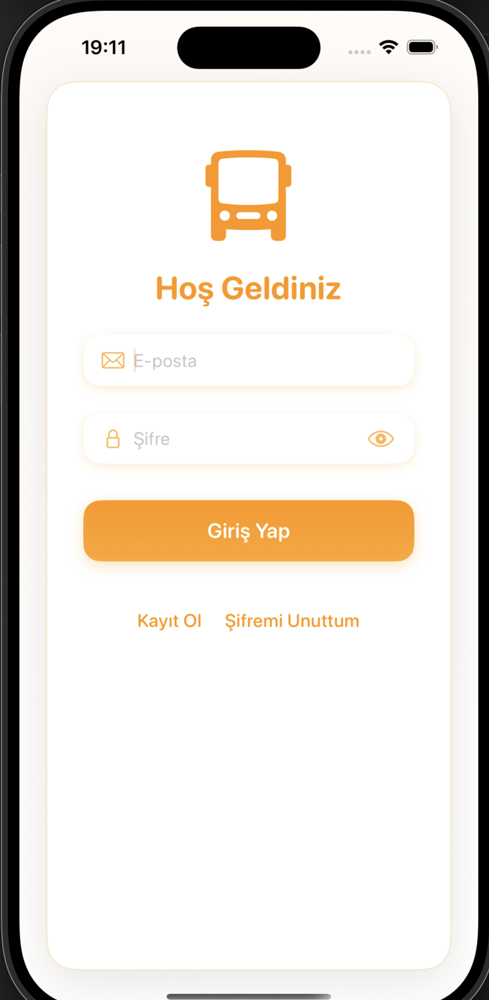
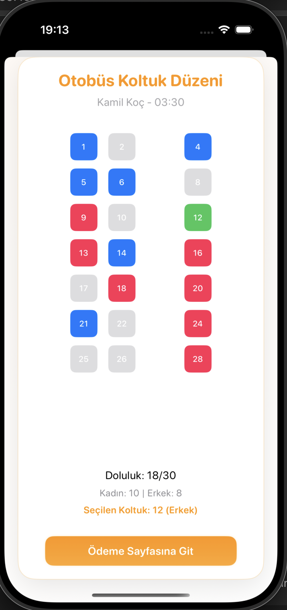
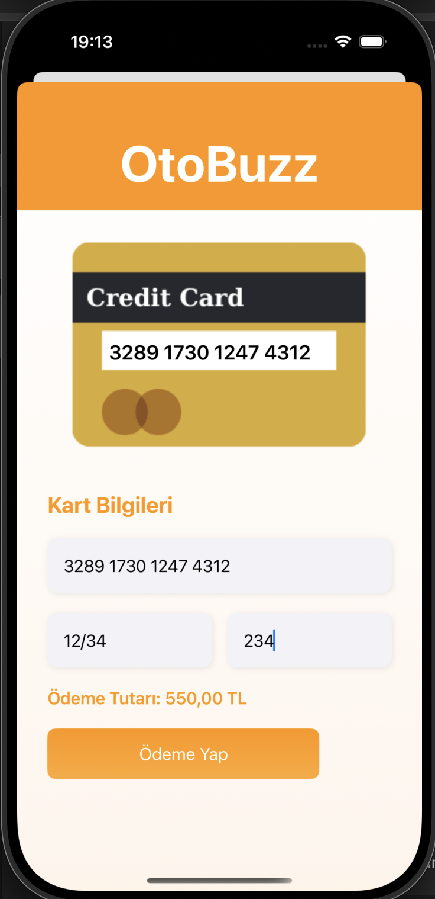

# 🚌 OtobuzzApp

OtobuzzApp, kullanıcıların otobüs bileti araması, koltuk seçimi ve online ödeme yaparak bilet satın almasını sağlayan modern ve kullanıcı dostu bir mobil uygulamadır.

---

## 🚀 Özellikler

- 🔐 Kullanıcı kayıt ve giriş işlemleri (JWT ile güvenli oturum)
- 📍 Sefer arama ve filtreleme (şehir, tarih, saat)
- 🪑 Koltuk seçimi (cinsiyet ve doluluk durumuna göre görsel ayrım)
- 💳 Ödeme sonrası e-posta bildirimi ve bilet kaydı
- 🎫 “Biletlerim” ekranı ile alınan biletlerin listelenmesi
- 📬 Kart bilgisi kaydetme seçeneği (isteğe bağlı)

---

## 🛠️ Kullanılan Teknolojiler

### Frontend (iOS):
- **SwiftUI**
- **MVVM mimarisi**
- **Combine**
- **URLSession** ile API bağlantısı

### Backend:
- **Node.js + Express.js**
- **MongoDB (Mongoose)**
- **JWT ile kimlik doğrulama**
- **Nodemailer** ile e-posta bildirimi

---

## 🔧 Kurulum

1. Reponun klonlanması:
    ```bash
    git clone https://github.com/mine-kirmaci/OtobuzzApp.git
    ```

2. Xcode ile `OtobuzzApp.xcodeproj` dosyasını aç

3. Backend için:
    ```bash
    cd bilet-api
    npm install
    npm run dev
    ```

---

## 📸 Ekran Görüntüleri

| Ana Sayfa | Sefer Listesi 1 | Sefer Listesi 2 | Koltuk Seçimi | Ödeme |
|-----------|------------------|------------------|----------------|--------|
|  |  |  |  |  |

> Bu görseller uygulamanın gerçek çalışmasından alınmıştır.
